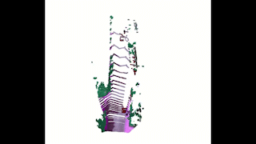
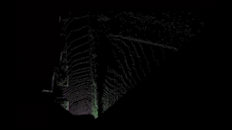
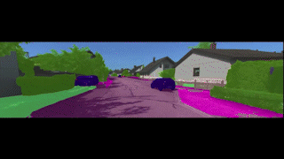

# semantic_mapping_icp

This is naive implementation of PointPainting where any image segmentation network can be used for 3D point cloud segmentaiton where each point is labelled with a class. In this case, SegFormer Transformer network is used to perform semantic segmentation on the images and the corresponding points in the pointcloud obtained from the LiDAR is classified. Several ICP registration trials using Open3d are also carried out to merge the pointclouds to obtain 3D reconstruction of the scene. For each pointcloud, the Bird's eye view is also obtained.
<br> For demonstration purposes, [KITTI Dataset](https://www.cvlibs.net/datasets/kitti/) is used.

## Results

To watch full video, click here [Link](https://youtu.be/2mXXd_wS-Yo).

### Semantically Segmented Pointcloud



### Bird's eye view


### Semantic segmentation results



## Installation

```
pip install torchvision==0.8.2
pip install timm==0.3.2
pip install mmcv-full==1.2.7
pip install opencv-python==4.5.1.48
cd seg && pip install -e . --user
```

For more details for installtion visit [SegFormer](https://github.com/NVlabs/SegFormer)

Works for any dataset (edit calibration file)


## File structure

    ├── seg SegFormer Folders
    ├── dataset    <--KITTI360
    |  ├── camera
    |  ├── calibration
    |  ├── lidar
    |  ├── painted_points_rgb
    |  ├── segmented_bev
    |  ├── segmented_imgs
    |  ├── segmented_pcd
    |  ├── whole_bev
    ├── code
    |  ├── utils.py 
    |  ├── calib.py
    |  ├── icp_trial_color_registration.py
    |  ├── icp_trial_global_registration.py
    |  ├── icp_trial_pose_graph_registration.py
    |  ├── segment_pcd.py
    |  ├── bev.py


